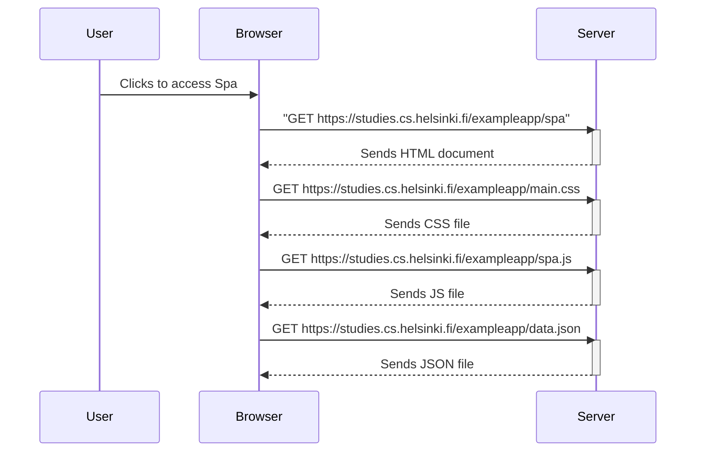

```mermaid
sequenceDiagram
    participant User
    participant Browser
    participant Server

    User->>Browser: Clicks to access Spa
    Browser->>Server: "GET https://studies.cs.helsinki.fi/exampleapp/spa"

    activate Server

    Server-->>Browser: Sends HTML document

    deactivate Server

    Browser->>Server: GET https://studies.cs.helsinki.fi/exampleapp/main.css

    activate Server

    Server-->>Browser: Sends CSS file

    deactivate Server

    Browser->>Server: GET https://studies.cs.helsinki.fi/exampleapp/spa.js

    activate Server

    Server-->>Browser: Sends JS file

    deactivate Server

    Browser->>Server: GET https://studies.cs.helsinki.fi/exampleapp/data.json

    activate Server

    Server-->>Browser: Sends JSON file

    deactivate Server

```